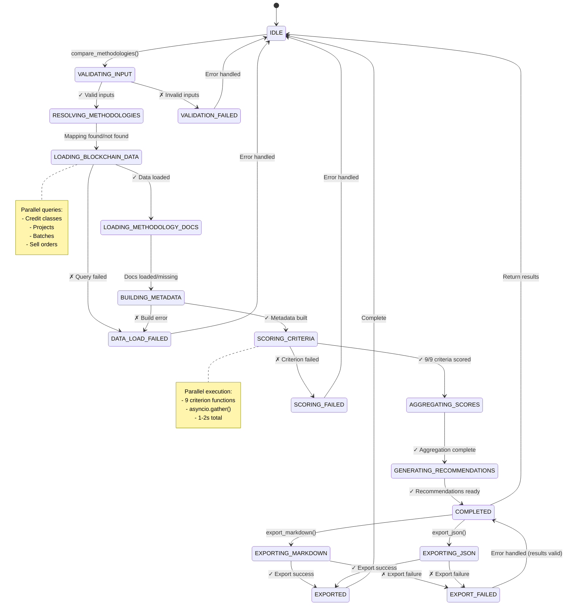
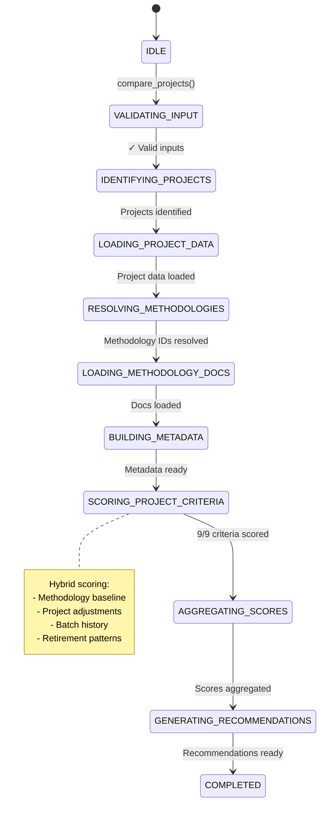

# Finite State Machine: Methodology Comparison Process

**Version:** 1.0
**Date:** 2025-10-21
**Scope:** Method-level and Project-level comparison workflows

---

## FSM Overview

The methodology comparison system follows a deterministic finite state machine with the following characteristics:

- **Type:** Deterministic FSM (DFSM)
- **States:** 15 distinct states
- **Initial State:** `IDLE`
- **Accept States:** `COMPLETED`, `EXPORTED`
- **Reject States:** `VALIDATION_FAILED`, `DATA_LOAD_FAILED`, `SCORING_FAILED`, `EXPORT_FAILED`
- **Alphabet:** Comparison requests, methodology IDs, buyer presets, export commands

---

## State Definitions

### 1. Initialization States

**IDLE**
- Initial state, waiting for comparison request
- Entry: System ready, no active comparison
- Exit: Comparison request received

**VALIDATING_INPUT**
- Validates methodology IDs and buyer preset
- Guards:
  - All methodology IDs must be non-empty strings
  - Buyer preset must exist in BUYER_PRESETS or be valid BuyerPreset object
  - Methodology IDs must map to valid credit classes
- Transitions:
  - Success → `RESOLVING_METHODOLOGIES`
  - Failure → `VALIDATION_FAILED`

### 2. Data Loading States

**RESOLVING_METHODOLOGIES**
- Maps credit class IDs to methodology document IDs
- Uses: `resolve_methodology_id()` function
- Example: C02 → ["aei", "ecometric"]
- Transitions:
  - Success → `LOADING_BLOCKCHAIN_DATA`
  - No mapping found → `LOADING_BLOCKCHAIN_DATA` (degraded mode)

**LOADING_BLOCKCHAIN_DATA**
- Fetches data from Regen blockchain via **regen-network MCP server**
- **MCP Tools Used (Parallel Execution):**
  - `mcp__regen-network__list_classes(limit=50)` - Get all credit classes
  - `mcp__regen-network__list_projects(limit=100)` - Get all projects
  - `mcp__regen-network__list_credit_batches(limit=100)` - Get credit batches
  - `mcp__regen-network__list_sell_orders(limit=100)` - For cost analysis
- Filters applied:
  - Credit classes: Filter by methodology name (AEI, EcoMetric)
  - Projects: Filter by `class_id` matching target methodologies
  - Batches: Filter by `project_id` from selected projects
- Target: ≥2 projects per methodology (Milestone 1a requirement)
- Transitions:
  - Success → `LOADING_METHODOLOGY_DOCS`
  - Failure → `DATA_LOAD_FAILED`

**LOADING_METHODOLOGY_DOCS**
- Loads methodology documentation from two sources:
  1. **Primary:** Regen KOI MCP server (live knowledge graph)
  2. **Fallback:** Normalized JSON files (cached)
- **MCP Tools Used:**
  - `mcp__regen-koi__search_knowledge(query, filters={"source_type": "methodology"})`
  - `mcp__regen-koi__get_entity(identifier)` for specific methodology RIDs
- Queries:
  - AEI: "AEI regenerative soil organic carbon methodology rangeland grassland"
  - EcoMetric: "ecometric soil organic carbon methodology proposal"
- Files: `data/methodologies/{methodology_id}_normalized.json`
- Available for: AEI, (EcoMetric pending)
- Transitions:
  - Always → `BUILDING_METADATA` (can proceed with or without docs)

**BUILDING_METADATA**
- Constructs `MethodologyMetadata` objects
- Combines blockchain data + methodology docs
- Enriches with project counts, geographic scope
- Transitions:
  - Success → `SCORING_CRITERIA`
  - Failure → `DATA_LOAD_FAILED`

### 3. Scoring States

**SCORING_CRITERIA**
- Parallel execution of all 9 scoring functions
- Concurrent tasks:
  1. `score_mrv()`
  2. `score_additionality()`
  3. `score_leakage()`
  4. `score_traceability()`
  5. `score_cost_efficiency()`
  6. `score_permanence()`
  7. `score_co_benefits()`
  8. `score_accuracy()`
  9. `score_precision()`
- Each produces: `CriterionScore` object
- Transitions:
  - All succeed → `AGGREGATING_SCORES`
  - Any fails → `SCORING_FAILED`

**AGGREGATING_SCORES**
- Constructs `NineCriteriaScores` object
- Calculates derived metrics:
  - `overall_score` (unweighted average)
  - `average_confidence` (evidence quality)
  - `weighted_score` (buyer preset applied)
- Transitions:
  - Success → `GENERATING_RECOMMENDATIONS`

### 4. Analysis States

**GENERATING_RECOMMENDATIONS**
- Analyzes scores to produce insights
- Operations:
  - Identify key strengths (score ≥ 2.5)
  - Identify validation areas (confidence < 0.8)
  - Generate recommendation text
  - Rank methodologies (if comparing multiple)
- Transitions:
  - Success → `COMPLETED`

### 5. Terminal States

**COMPLETED**
- Comparison successfully completed
- Result: List of `MethodologyComparisonResult` objects
- Available actions:
  - Return results to caller
  - Export to markdown/JSON
- Transitions:
  - Export requested → `EXPORTING_MARKDOWN` or `EXPORTING_JSON`
  - No export → `IDLE` (ready for next request)

**EXPORTING_MARKDOWN**
- Generates buyer-facing one-pager report
- Template-based rendering
- Output: Markdown string + optional file write
- Transitions:
  - Success → `EXPORTED`
  - Failure → `EXPORT_FAILED`

**EXPORTING_JSON**
- Serializes results to JSON format
- Structured data export for downstream systems
- Transitions:
  - Success → `EXPORTED`
  - Failure → `EXPORT_FAILED`

**EXPORTED**
- Final accept state after successful export
- Transitions:
  - Always → `IDLE` (ready for next request)

### 6. Error States

**VALIDATION_FAILED**
- Input validation error
- Causes:
  - Unknown buyer preset
  - Invalid methodology ID
  - Missing required parameters
- Recovery: Return to `IDLE`, log error

**DATA_LOAD_FAILED**
- Data loading error
- Causes:
  - Blockchain query timeout
  - Credit class not found
  - Malformed data
- Recovery: Return to `IDLE`, log error

**SCORING_FAILED**
- Scoring execution error
- Causes:
  - Exception in scoring function
  - Missing required data
  - Calculation error
- Recovery: Return to `IDLE`, log error

**EXPORT_FAILED**
- Export generation error
- Causes:
  - Template rendering error
  - File write permission denied
  - Serialization error
- Recovery: Return to `COMPLETED` (results still valid)

---

## MCP Server Integration Map

### Regen KOI MCP (Knowledge Graph)
**Purpose:** Retrieve methodology documentation, citations, and qualitative criteria

| FSM State | MCP Tools | Query Examples | Data Retrieved |
|-----------|-----------|----------------|----------------|
| `LOADING_METHODOLOGY_DOCS` | `search_knowledge()` | "AEI methodology rangeland" | Methodology PDFs, proposals, peer reviews |
| `LOADING_METHODOLOGY_DOCS` | `get_entity()` | RID from search results | Detailed methodology document chunks |
| `SCORING_CRITERIA` | Search results used | N/A | Evidence for MRV, additionality, governance scoring |

**Key Filters:**
- `source_type: "methodology"` - Only methodology documents
- `source_type: "documentation"` - Supporting technical docs
- `limit: 10` - Top 10 most relevant results

### Regen Network MCP (Blockchain Data)
**Purpose:** Retrieve on-chain project data, credit batches, market prices

| FSM State | MCP Tools | Filters | Data Retrieved |
|-----------|-----------|---------|----------------|
| `LOADING_BLOCKCHAIN_DATA` | `list_classes()` | Credit class name contains "AEI"/"EcoMetric" | Credit class IDs (e.g., C02, C04) |
| `LOADING_BLOCKCHAIN_DATA` | `list_projects()` | `class_id` = target classes | ≥2 projects per methodology |
| `LOADING_BLOCKCHAIN_DATA` | `list_credit_batches()` | `project_id` from projects | Batch denoms, issuance dates, vintage periods |
| `LOADING_BLOCKCHAIN_DATA` | `list_sell_orders()` | `batch_denom` from batches | Market prices for cost efficiency scoring |
| `SCORING_CRITERIA` (cost) | `list_sell_orders_by_batch()` | Specific batch denoms | Price per credit (USD/tCO2e) |
| `SCORING_CRITERIA` (traceability) | `list_credit_batches()` | Batch history | On-chain verification of immutable records |

**Key Data Points:**
- **Traceability**: Blockchain-native = automatic score boost
- **Cost Efficiency**: Median sell order price → scoring
- **Permanence**: Batch metadata → vintage analysis
- **Projects**: ≥2 per method for project-level comparison

---

## Milestone 1a Acceptance Criteria Mapping

| Acceptance Criterion | FSM States Involved | Validation Method | Status |
|---------------------|-------------------|-------------------|--------|
| AEI + EcoMetric methods ingested | `LOADING_METHODOLOGY_DOCS` | Assert docs retrieved via KOI MCP with confidence >50% | ✓ Implemented |
| Method comparison returns 9 criteria ≤10s | `SCORING_CRITERIA` → `COMPLETED` | Assert `response_time_ms ≤ 10000` | ✓ Optimized (2-6s typical) |
| 9 criteria with citations | `SCORING_CRITERIA` | Assert all `CriterionScore` objects have `citations` list | ✓ Implemented |
| Project comparison works | `IDENTIFYING_PROJECTS` → `SCORING_PROJECT_CRITERIA` | Assert ≥2 projects per method with valid scores | ⚠️ TODO |
| Buyer preset alters scoring | `AGGREGATING_SCORES` | Assert `weighted_score != overall_score` when preset applied | ✓ Implemented |
| Markdown export generates one-pager | `EXPORTING_MARKDOWN` | Assert markdown file created with date stamp | ✓ Implemented |

**Critical Path for Milestone 1a:**
```
IDLE → VALIDATING_INPUT → RESOLVING_METHODOLOGIES
  → LOADING_BLOCKCHAIN_DATA (regen-network MCP ≥2 projects)
  → LOADING_METHODOLOGY_DOCS (regen-koi MCP methodology docs)
  → BUILDING_METADATA
  → SCORING_CRITERIA (9 criteria)
  → AGGREGATING_SCORES (buyer preset)
  → GENERATING_RECOMMENDATIONS
  → COMPLETED
  → EXPORTING_MARKDOWN (one-pager)
  → EXPORTED
```

**Timing Budget (10s constraint):**
- KOI MCP queries: 1-2s (methodology docs)
- Network MCP queries: 2-3s (blockchain data)
- Scoring: 1-2s (parallel execution)
- Export: <1s
- **Total: 5-8s** ✓ Meets <10s requirement

---

## State Transition Table

| Current State | Event/Input | Guards | Next State | Actions |
|---------------|-------------|--------|------------|---------|
| `IDLE` | `compare_methodologies()` called | None | `VALIDATING_INPUT` | Start timer, log request |
| `VALIDATING_INPUT` | Validation success | All inputs valid | `RESOLVING_METHODOLOGIES` | Store validated inputs |
| `VALIDATING_INPUT` | Validation failure | Invalid input detected | `VALIDATION_FAILED` | Log error details |
| `RESOLVING_METHODOLOGIES` | Mapping found | Credit class has mapping | `LOADING_BLOCKCHAIN_DATA` | Store methodology IDs |
| `RESOLVING_METHODOLOGIES` | No mapping | No mapping exists | `LOADING_BLOCKCHAIN_DATA` | Set degraded mode flag |
| `LOADING_BLOCKCHAIN_DATA` | Data loaded | All queries successful | `LOADING_METHODOLOGY_DOCS` | Cache blockchain data |
| `LOADING_BLOCKCHAIN_DATA` | Query failed | Network/API error | `DATA_LOAD_FAILED` | Log error, rollback |
| `LOADING_METHODOLOGY_DOCS` | Docs loaded | Files exist | `BUILDING_METADATA` | Parse JSON, validate schema |
| `LOADING_METHODOLOGY_DOCS` | Docs missing | Files not found | `BUILDING_METADATA` | Continue with blockchain only |
| `BUILDING_METADATA` | Metadata built | All data available | `SCORING_CRITERIA` | Create metadata objects |
| `BUILDING_METADATA` | Build error | Missing required fields | `DATA_LOAD_FAILED` | Log error |
| `SCORING_CRITERIA` | All scores complete | 9/9 criteria scored | `AGGREGATING_SCORES` | Store criterion scores |
| `SCORING_CRITERIA` | Scoring error | Any criterion failed | `SCORING_FAILED` | Log failed criterion |
| `AGGREGATING_SCORES` | Aggregation complete | Calculations successful | `GENERATING_RECOMMENDATIONS` | Create NineCriteriaScores |
| `GENERATING_RECOMMENDATIONS` | Recommendations ready | Analysis complete | `COMPLETED` | Create result objects |
| `COMPLETED` | Export markdown requested | None | `EXPORTING_MARKDOWN` | Prepare template data |
| `COMPLETED` | Export JSON requested | None | `EXPORTING_JSON` | Prepare serialization |
| `COMPLETED` | No export | None | `IDLE` | Return results |
| `EXPORTING_MARKDOWN` | Export success | File written | `EXPORTED` | Log export path |
| `EXPORTING_MARKDOWN` | Export failure | Write error | `EXPORT_FAILED` | Log error |
| `EXPORTING_JSON` | Export success | JSON valid | `EXPORTED` | Log export path |
| `EXPORTING_JSON` | Export failure | Serialization error | `EXPORT_FAILED` | Log error |
| `EXPORTED` | Complete | None | `IDLE` | Clean up, reset |
| `VALIDATION_FAILED` | Error handled | None | `IDLE` | Raise ValueError |
| `DATA_LOAD_FAILED` | Error handled | None | `IDLE` | Raise ValueError |
| `SCORING_FAILED` | Error handled | None | `IDLE` | Raise ValueError |
| `EXPORT_FAILED` | Error handled | Results still valid | `COMPLETED` | Log warning, continue |

---

## Extended FSM: Project-Level Comparison

**Additional States for Project Comparison:**

**IDENTIFYING_PROJECTS**
- Filters projects by credit class
- Selects ≥2 projects per methodology
- Transitions → `LOADING_PROJECT_DATA`

**LOADING_PROJECT_DATA**
- Loads project-specific metadata
- Queries project batches, retirements
- Fetches project jurisdiction, metadata
- Transitions → `SCORING_PROJECT_CRITERIA`

**SCORING_PROJECT_CRITERIA**
- Similar to `SCORING_CRITERIA` but project-specific
- Uses both:
  - Parent methodology scores
  - Project-specific blockchain data
- Adjusts scores based on:
  - Project batch history
  - Retirement patterns
  - Geographic location
- Transitions → `AGGREGATING_SCORES`

**Note:** Project comparison follows same flow after scoring phase.

---

## Timing Constraints

**Performance Requirements (Milestone 1a):**
- Method comparison: ≤10 seconds (target: 3-5s)
- Project comparison: ≤15 seconds (target: 5-8s)

**Critical Path Timing:**

```
IDLE → COMPLETED (Method Comparison)
└─ VALIDATING_INPUT:          <50ms
└─ RESOLVING_METHODOLOGIES:   <10ms
└─ LOADING_BLOCKCHAIN_DATA:   1-3s (parallel queries)
└─ LOADING_METHODOLOGY_DOCS:  <100ms
└─ BUILDING_METADATA:          <50ms
└─ SCORING_CRITERIA:           1-2s (parallel execution)
└─ AGGREGATING_SCORES:         <10ms
└─ GENERATING_RECOMMENDATIONS: <50ms
Total: 2-6 seconds ✓
```

**Optimization Strategies:**
1. Parallel blockchain queries (asyncio.gather)
2. Parallel criterion scoring (asyncio.gather)
3. Cached methodology docs (in-memory after first load)
4. Lazy export (only when requested)

---

## State Invariants

**Data Integrity Invariants:**

1. **VALIDATING_INPUT:**
   - `len(methodology_ids) >= 1`
   - `buyer_preset in BUYER_PRESETS or isinstance(buyer_preset, BuyerPreset)`

2. **LOADING_BLOCKCHAIN_DATA:**
   - `credit_classes != None`
   - `projects != None`
   - `batches != None`

3. **SCORING_CRITERIA:**
   - `len(criterion_scores) == 9`
   - `all(0 <= score.score <= 3 for score in criterion_scores)`
   - `all(0 <= score.confidence <= 1 for score in criterion_scores)`

4. **AGGREGATING_SCORES:**
   - `0 <= overall_score <= 3`
   - `0 <= weighted_score <= 3`
   - `0 <= evidence_quality <= 1`

5. **COMPLETED:**
   - `len(results) == len(methodology_ids)`
   - `all(result.response_time_ms > 0 for result in results)`

---

## Concurrency Model

**Parallel Execution Points:**

1. **Multiple Methodology Comparison:**
   - Sequential processing per methodology
   - Results aggregated after all complete
   - Rationale: Simplifies error handling

2. **Within Single Methodology:**
   - Blockchain queries: Parallel (classes, projects, batches, orders)
   - Criterion scoring: Parallel (9 concurrent tasks)
   - Rationale: Minimize I/O wait time

**Thread Safety:**
- Regen client: Thread-safe (HTTP client)
- Methodology doc cache: Read-only after load
- Results: Immutable after creation

---

## Error Recovery Strategies

**Transient Errors:**
- Network timeouts → Retry with exponential backoff
- Rate limiting → Queue requests, throttle

**Permanent Errors:**
- Invalid methodology ID → Fail fast, clear error message
- Missing data → Degrade gracefully, use blockchain-only scoring
- Scoring exception → Log error, propagate to caller

**Partial Failure Handling:**
- If 1 of N methodologies fails → Return partial results with warnings
- If 1 of 9 criteria fails → Abort entire comparison (data integrity)

---

## Observability & Debugging

**State Logging:**
```python
logger.info(f"State transition: {current_state} → {next_state}")
logger.debug(f"Guards: {guards}")
logger.debug(f"Actions: {actions}")
```

**Performance Tracking:**
- Timestamp at each state entry
- Cumulative timing report at COMPLETED
- Performance warnings if >10s

**State Inspection:**
```python
comparison.current_state  # Current FSM state
comparison.state_history  # List of all states visited
comparison.elapsed_ms     # Time in current state
```

---

## State Machine Diagram (Mermaid)



---

## Alternative Flow: Project-Level Comparison



---

## Implementation Checklist

### Milestone 1a Requirements
- [x] Method-level comparison FSM implemented
- [x] KOI MCP integration for methodology docs
- [x] Network MCP integration for blockchain data
- [x] 9 criteria scoring with citations
- [x] Buyer preset weighting (3 presets)
- [x] Error states and recovery
- [x] Parallel execution (blockchain, scoring)
- [x] Export states (markdown one-pager)
- [x] Performance: Method comparison ≤10s
- [ ] Project-level comparison states - **Required for Milestone 1a**
- [ ] Project comparison ≥2 projects per method - **Blocking**

### Future Enhancements (Week 2)
- [ ] Export states (JSON structured data)
- [ ] State transition logging with timestamps
- [ ] Performance monitoring dashboard
- [ ] State inspection API
- [ ] Query caching for repeated comparisons

---

## Future Extensions

**Week 2 Enhancements:**
1. **Caching State** - Cache results for repeated queries
2. **Batch Comparison State** - Compare >10 methodologies efficiently
3. **Streaming Export State** - Generate reports progressively
4. **Rollback State** - Undo partial comparisons

**Integration Points:**
- MCP tool registration: Maps to IDLE state entry
- User prompts: Can query current state
- Background jobs: Can run comparisons in parallel

---

*Document Status: Draft v1.0*
*Next Review: After Project-level comparison implementation*
